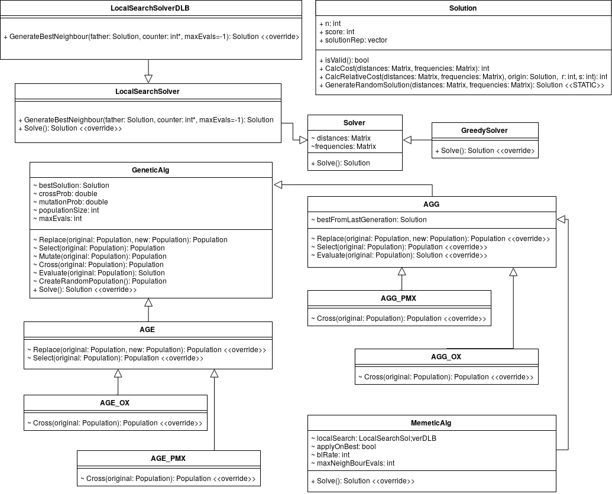

A collection of different metaheuristics written in C++ to solve QAP problems.

### Available Algorithms
- Greedy
- Randomized Greedy
- Local Search
- Local Search with Don't loock Bits mask
- Genetic (Generational and Estacionary)
- Memetic (Based on Generational Genetic Algorithm)
- Simulated Annealing
- Basic Multistart Search
- GRASP
- Iterated Local Search
- Iterated Local Search using Simulated Annealing instead of Local search



### Compilation
In order to compile with debug symbols:
```bash
cd build/
cmake -D CMAKE_BUILD_TYPE=Debug ..
make
```

To compile with optimization:
```bash
cd build/
cmake -D CMAKE_BUILD_TYPE=Release ..
make
```

### Execution

```bash
./bin/main <problem> <random_seed>
```

Parameters:
- Problem: QAP problem definition, you can find some of them in ***instancias/***
- Random Seed: Seed for random numbers generator, default is 7

Example:
```bash
./bin/main ./instancias/chr22a.dat 7
```